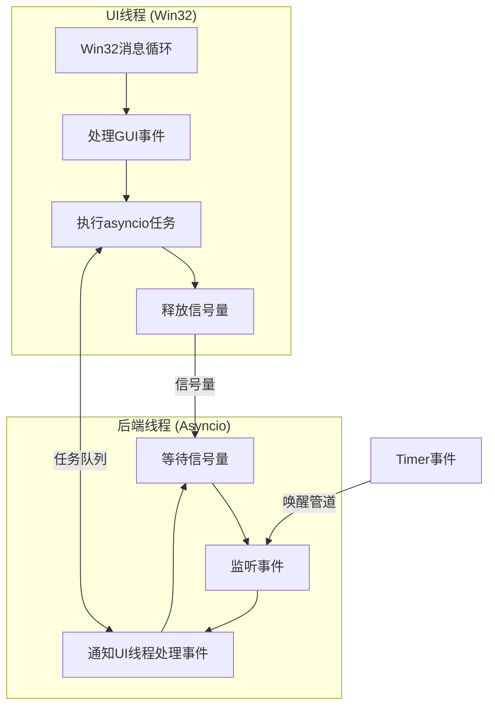
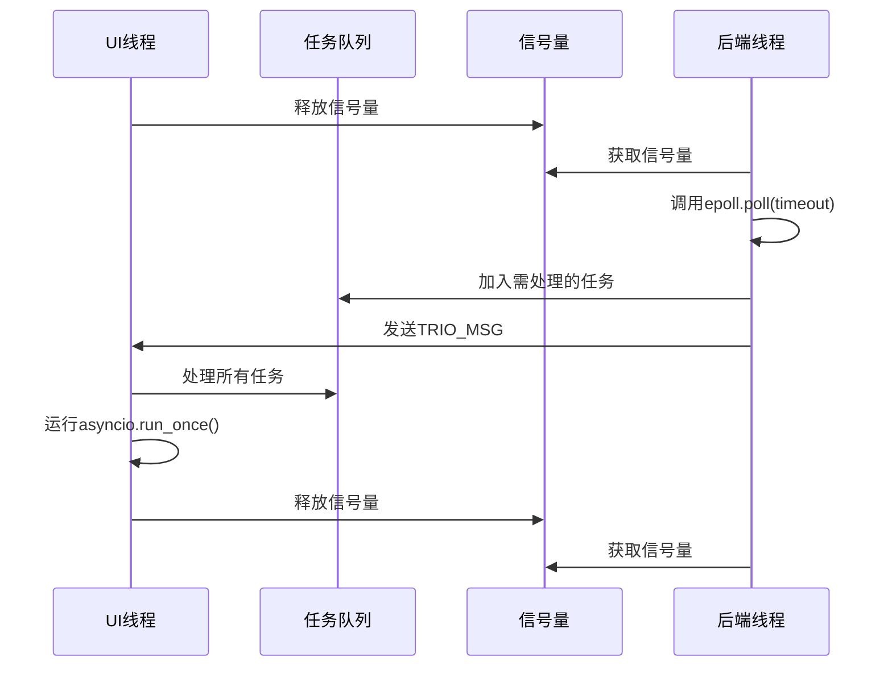
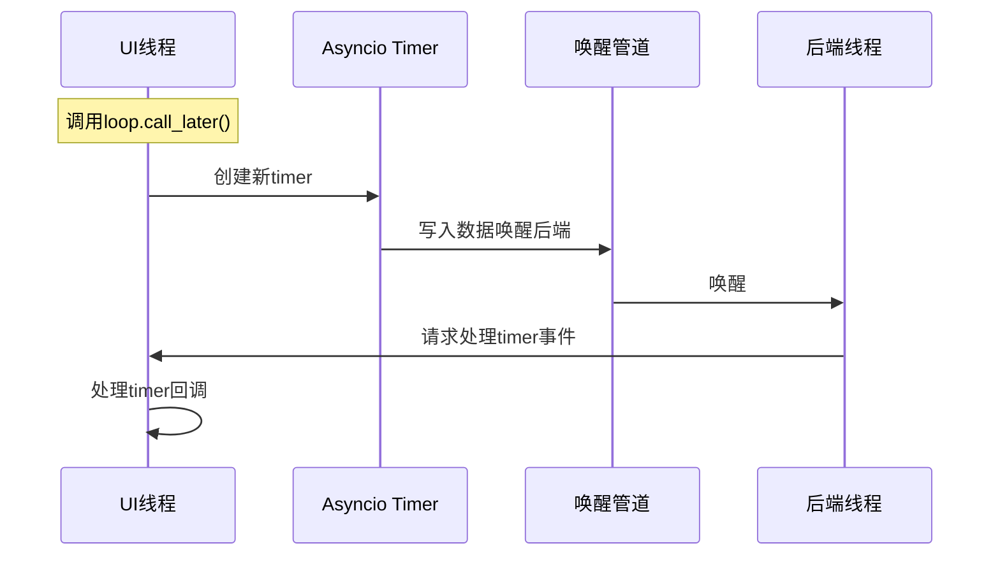

<think>我需要生成一个markdown文件，描述Win32和Asyncio双线程协作机制的关键思路和设计说明。我会使用mermaid语法来绘制图表，因为这是用户请求的。

我将涵盖以下内容：
1. 基本架构概述
2. 两个线程的职责
3. 线程间协调机制
4. 关键事件流程
5. 实现注意事项

这应该是一个全面但简明的文档，用于解释asyncio_guest_run的工作原理。</think># Win32 和 Asyncio 双线程协作机制

## 基本架构

## 核心设计思路

### 1. 双线程模型

- **UI线程**：负责Win32消息循环和GUI事件处理
- **后端线程**：负责监听asyncio事件循环中的事件

这种分离允许GUI保持响应性，同时异步操作在后台执行。

### 2. 线程协调机制

1. **信号量(Semaphore)**：用于确保两个线程交替执行，防止竞态条件
2. **任务队列**：线程安全的队列，用于传递需要在UI线程执行的函数
3. **唤醒管道(Wake Pipe)**：允许后端线程在接收到新事件(如计时器)时被唤醒

### 3. 消息传递机制

1. **TRIO_MSG**：自定义Win32消息，用于在UI线程中触发asyncio任务处理
2. **PostMessage**：从后端线程安全地发送消息到UI线程
3. **run_sync_soon_threadsafe**：将函数加入队列并通知UI线程执行

## 关键事件流程

### 初始化流程

1. 创建新的asyncio事件循环
2. 设置信号量、唤醒管道和任务队列
3. 修补`call_later`函数以支持唤醒机制
4. 启动后端线程
5. 初始调用`run_events_on_ui_thread`并释放信号量

### 正常事件循环

### Timer事件处理

## 实现注意事项

1. **错误处理**：后端线程和UI线程都需要完善的异常捕获和处理
2. **资源清理**：在任务完成时正确关闭事件循环、管道和epoll
3. **兼容性**：处理不同版本asyncio的API差异
4. **死锁防护**：确保信号量在所有路径上都能正确释放
5. **计时器精度**：使用唤醒机制确保计时器能及时处理

## 关键函数说明

### asyncio_guest_run

主要入口函数，负责设置双线程环境并启动asyncio任务。

### run_events_on_ui_thread

在UI线程中执行asyncio事件循环的一个周期，处理就绪的回调和I/O事件。

### backend_thread_loop

后端线程的主循环，负责监听文件描述符事件和计时器超时。

### wake_backend_4_timer

在创建新timer时唤醒后端线程，确保计时器事件得到及时处理。

## 总结

这种设计通过精心协调Win32消息循环和asyncio事件循环，实现了在GUI应用中使用Python异步编程的能力。信号量确保了线程间的同步，而唤醒机制和消息队列提供了高效的通信渠道，解决了传统asyncio单线程模型在GUI环境中的限制。
