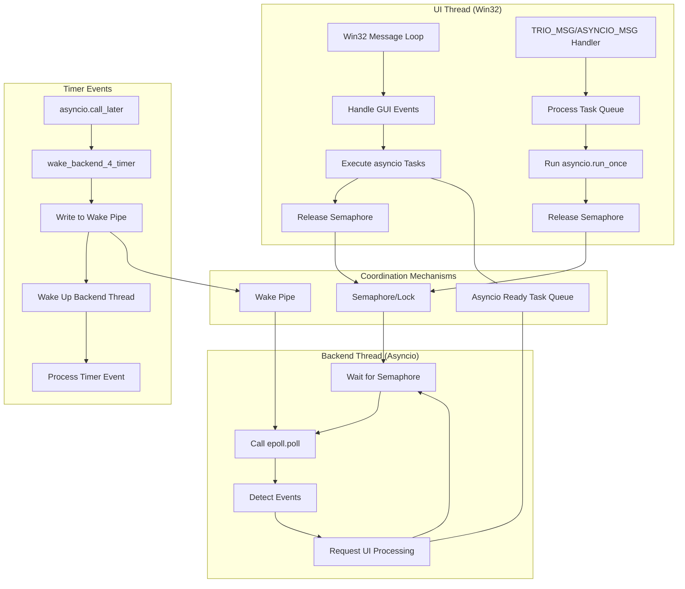
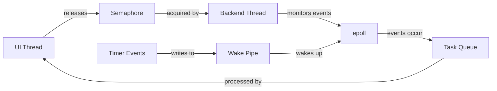
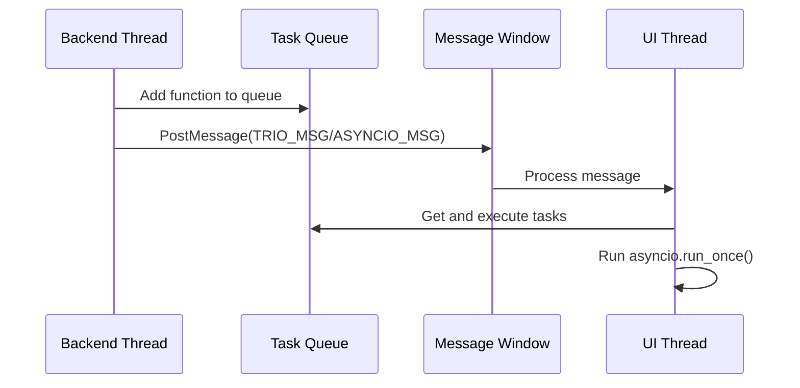
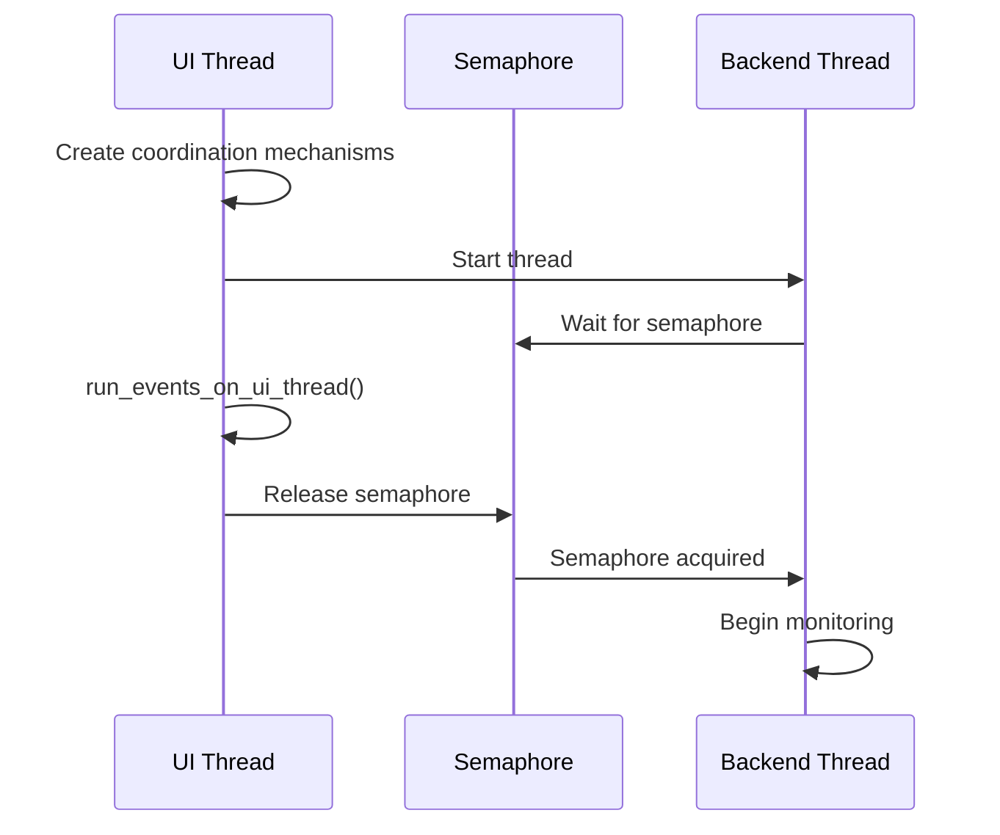
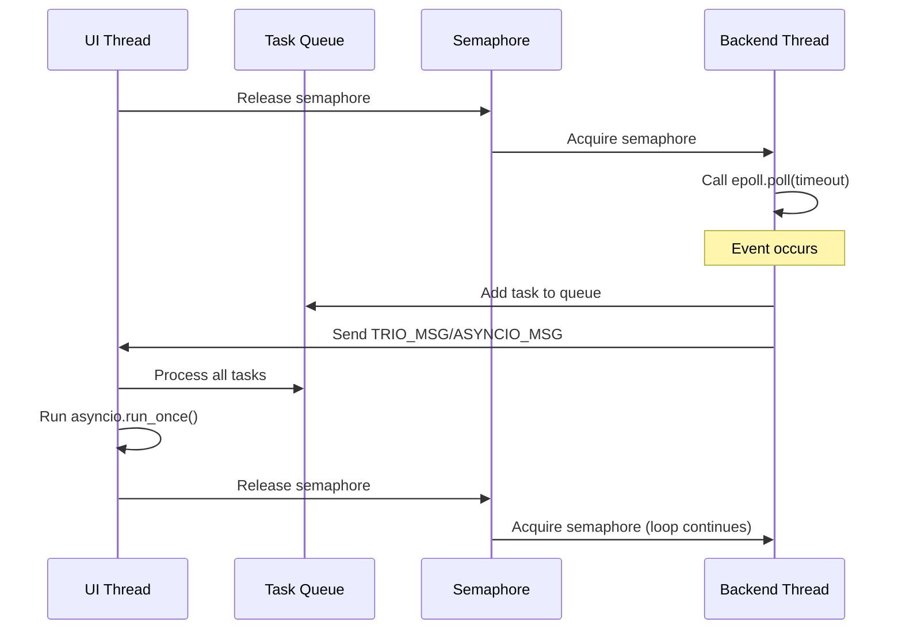
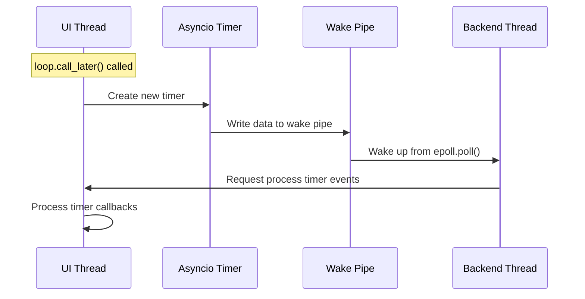
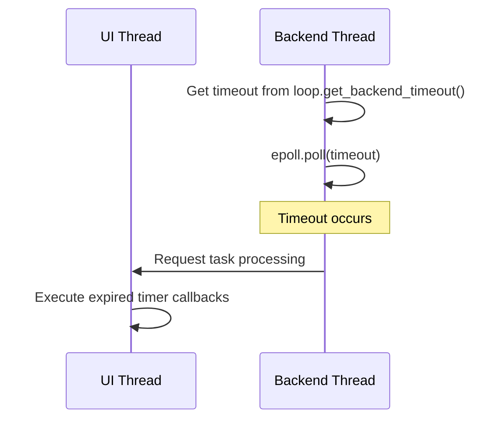
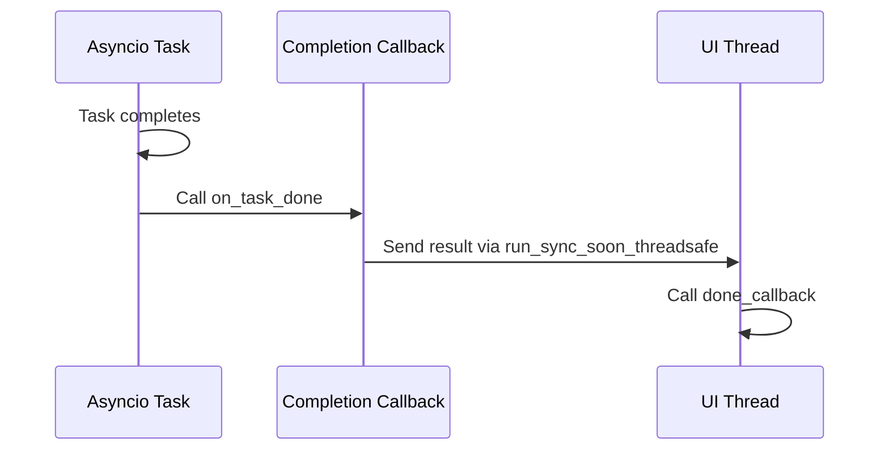

# Win32 and Asyncio Dual-Thread Collaboration Design

## Architecture Diagram

## Core Design Principles

### 1. Dual-Thread Model

- **UI Thread**: Responsible for Win32 message loop and GUI event handling
- **Backend Thread**: Responsible for monitoring events in the asyncio event loop

This separation allows the GUI to remain responsive while asynchronous operations run in the background.

### 2. Thread Coordination Mechanisms

1. **Semaphore**: Ensures the two threads execute alternately, preventing race conditions
2. **Task Queue**: Thread-safe queue for passing functions that need to be executed on the UI thread
3. **Wake Pipe**: Allows the backend thread to be awakened when new events (like timers) occur

### 3. Message Passing Mechanisms

1. **TRIO_MSG/ASYNCIO_MSG**: Custom Win32 message used to trigger asyncio task processing in the UI thread
2. **PostMessage**: Safely sends messages from the backend thread to the UI thread
3. **run_sync_soon_threadsafe**: Adds functions to the queue and notifies the UI thread to execute them

## Key Event Flows

### 1. Initialization Process

### 2. Normal Event Loop

### 3. New Timer Event Flow

### 4. Timeout Handling Flow

### 5. Task Completion Flow

## Implementation Considerations

1. **Error Handling**: Both backend and UI threads need robust exception catching and handling
2. **Resource Cleanup**: Properly close event loop, pipes, and epoll when tasks complete
3. **Compatibility**: Handle API differences between asyncio versions
4. **Deadlock Prevention**: Ensure semaphores are correctly released in all paths
5. **Timer Precision**: Use wake mechanism to ensure timers are processed promptly

## Key Function Descriptions

### asyncio_guest_run

Main entry function responsible for setting up the dual-thread environment and starting the asyncio task.

### run_events_on_ui_thread

Executes one cycle of the asyncio event loop on the UI thread, handling ready callbacks and I/O events.

### backend_thread_loop

Main loop of the backend thread, responsible for monitoring file descriptor events and timer timeouts.

### wake_backend_4_timer

Wakes up the backend thread when new timers are created, ensuring timer events are processed promptly.

## Summary

This design coordinates the Win32 message loop and asyncio event loop through careful orchestration, enabling the use of Python's asynchronous programming in GUI applications. Semaphores ensure synchronization between threads, while wake mechanisms and message queues provide efficient communication channels, solving the limitations of the traditional single-threaded asyncio model in GUI environments.
